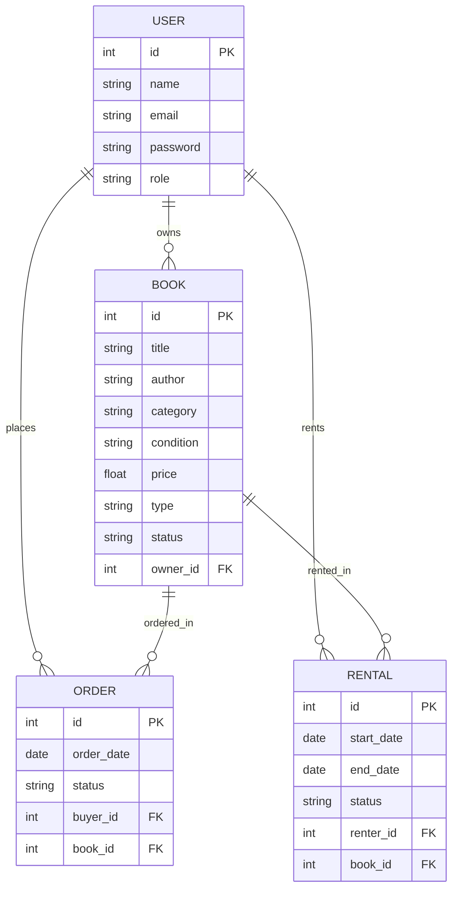

```mermaid
erDiagram

USER {
  int id PK
  string name
  string email
  string password
  string role
}

BOOK {
  int id PK
  string title
  string author
  string category
  string condition
  float price
  string type
  string status
  int owner_id FK
}

ORDER {
  int id PK
  date order_date
  string status
  int buyer_id FK
  int book_id FK
}

RENTAL {
  int id PK
  date start_date
  date end_date
  string status
  int renter_id FK
  int book_id FK
}

USER ||--o{ BOOK : owns
USER ||--o{ ORDER : places
USER ||--o{ RENTAL : rents
BOOK ||--o{ ORDER : ordered_in
BOOK ||--o{ RENTAL : rented_in
```