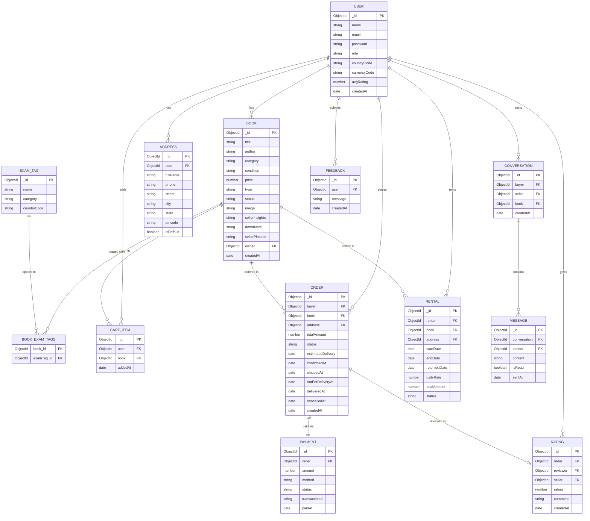

# ER Diagram

```mermaid
erDiagram

    USER {
        ObjectId _id PK
        string name
        string email
        string password
        string role
        string countryCode
        string currencyCode
        number avgRating
        date createdAt
    }

    BOOK {
        ObjectId _id PK
        string title
        string author
        string category
        string condition
        number price
        string type
        string status
        string image
        string sellerInsights
        string donorNote
        string sellerPincode
        ObjectId owner FK
        date createdAt
    }

    EXAM_TAG {
        ObjectId _id PK
        string name
        string category
        string countryCode
    }

    BOOK_EXAM_TAGS {
        ObjectId book_id FK
        ObjectId examTag_id FK
    }

    ADDRESS {
        ObjectId _id PK
        ObjectId user FK
        string fullName
        string phone
        string street
        string city
        string state
        string pincode
        boolean isDefault
    }

    CART_ITEM {
        ObjectId _id PK
        ObjectId user FK
        ObjectId book FK
        date addedAt
    }

    ORDER {
        ObjectId _id PK
        ObjectId buyer FK
        ObjectId book FK
        ObjectId address FK
        number totalAmount
        string status
        date estimatedDelivery
        date confirmedAt
        date shippedAt
        date outForDeliveryAt
        date deliveredAt
        date cancelledAt
        date createdAt
    }

    PAYMENT {
        ObjectId _id PK
        ObjectId order FK
        number amount
        string method
        string status
        string transactionId
        date paidAt
    }

    RENTAL {
        ObjectId _id PK
        ObjectId renter FK
        ObjectId book FK
        ObjectId address FK
        date startDate
        date endDate
        date returnedDate
        number dailyRate
        number totalAmount
        string status
    }

    RATING {
        ObjectId _id PK
        ObjectId order FK
        ObjectId reviewer FK
        ObjectId seller FK
        number rating
        string comment
        date createdAt
    }

    CONVERSATION {
        ObjectId _id PK
        ObjectId buyer FK
        ObjectId seller FK
        ObjectId book FK
        date createdAt
    }

    MESSAGE {
        ObjectId _id PK
        ObjectId conversation FK
        ObjectId sender FK
        string content
        boolean isRead
        date sentAt
    }

    FEEDBACK {
        ObjectId _id PK
        ObjectId user FK
        string message
        date createdAt
    }

    USER ||--o{ BOOK : "lists"
    USER ||--o{ ADDRESS : "has"
    USER ||--o{ CART_ITEM : "adds"
    USER ||--o{ ORDER : "places"
    USER ||--o{ RENTAL : "rents"
    USER ||--o{ RATING : "gives"
    USER ||--o{ CONVERSATION : "starts"
    USER ||--o{ FEEDBACK : "submits"

    BOOK ||--o{ CART_ITEM : "in"
    BOOK ||--o{ ORDER : "ordered in"
    BOOK ||--o{ RENTAL : "rented in"
    BOOK ||--o{ BOOK_EXAM_TAGS : "tagged with"

    EXAM_TAG ||--o{ BOOK_EXAM_TAGS : "applies to"

    ORDER ||--|| PAYMENT : "paid via"
    ORDER ||--o| RATING : "reviewed in"

    CONVERSATION ||--o{ MESSAGE : "contains"
```
