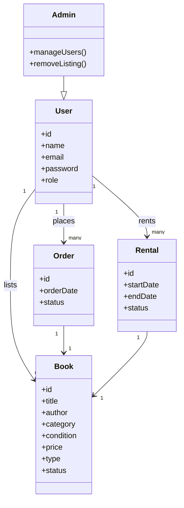

```mermaid
classDiagram

class User {
  +id
  +name
  +email
  +password
  +role
}

class Book {
  +id
  +title
  +author
  +category
  +condition
  +price
  +type
  +status
}

class Order {
  +id
  +orderDate
  +status
}

class Rental {
  +id
  +startDate
  +endDate
  +status
}

class Admin {
  +manageUsers()
  +removeListing()
}

User "1" --> "many" Book : lists
User "1" --> "many" Order : places
User "1" --> "many" Rental : rents
Order "1" --> "1" Book
Rental "1" --> "1" Book
Admin --|> User
```