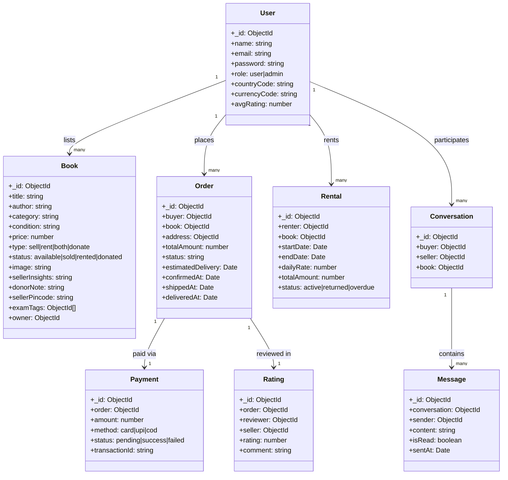

# Class Diagram

## Repository Layer — OOP Inheritance (BaseRepository Pattern)

```mermaid
classDiagram
    class BaseRepository {
        <<abstract>>
        #model: Model
        +findById(id) Document
        +findAll(filter, skip, limit) Document[]
        +count(filter) number
        +create(data) Document
        +update(id, data) Document
        +delete(id) boolean
    }

    class UserRepository {
        +findByEmail(email) IUser
        +updateAvgRating(sellerId) void
    }

    class BookRepository {
        +buildFilter(query) FilterQuery
        +search(query, skip, limit) IBook[]
        +findByOwner(ownerId) IBook[]
        +findWithOwner(id) IBook
        +updateStatus(id, status) IBook
    }

    class OrderRepository {
        +findByBuyer(buyerId) IOrder[]
        +findBySeller(sellerId) IOrder[]
        +findWithDetails(id) IOrder
        +updateStatus(id, status, timestamps) IOrder
    }

    class CartRepository {
        +findByUser(userId) ICartItem[]
        +findItem(userId, bookId) ICartItem
        +clearByUser(userId) void
    }

    class AddressRepository {
        +findByUser(userId) IAddress[]
        +clearDefault(userId) void
        +setDefault(id) IAddress
    }

    class PaymentRepository {
        +findByOrder(orderId) IPayment
        +markSuccess(id, txnId) IPayment
    }

    class RentalRepository {
        +findByRenter(renterId) IRental[]
        +markReturned(id) IRental
        +findOverdue() IRental[]
    }

    class RatingRepository {
        +findBySeller(sellerId) IRating[]
        +existsForOrder(orderId) boolean
    }

    class ChatRepository {
        +findOrCreate(buyerId, sellerId, bookId) IConversation
        +getUserConversations(userId) IConversation[]
        +getMessages(conversationId) IMessage[]
        +createMessage(data) IMessage
    }

    class FeedbackRepository {
        +findAllWithUser() IFeedback[]
    }

    BaseRepository <|-- UserRepository
    BaseRepository <|-- BookRepository
    BaseRepository <|-- OrderRepository
    BaseRepository <|-- CartRepository
    BaseRepository <|-- AddressRepository
    BaseRepository <|-- PaymentRepository
    BaseRepository <|-- RentalRepository
    BaseRepository <|-- RatingRepository
    BaseRepository <|-- ChatRepository
    BaseRepository <|-- FeedbackRepository
```

---

## Service Layer — Business Logic

```mermaid
classDiagram
    class AuthService {
        +register(data) token
        +login(email, password) token
        -generateToken(user) string
        -sanitize(user) object
    }

    class BookService {
        +getAll(query) PaginatedResponse
        +getById(id) IBook
        +create(ownerId, data) IBook
        +update(id, ownerId, data) IBook
        +remove(id, ownerId) void
        +getMyListings(ownerId, query) PaginatedResponse
    }

    class OrderService {
        +placeOrder(buyerId, bookId, addressId) IOrder
        +getBuyerOrders(buyerId, query) PaginatedResponse
        +getSellerOrders(sellerId, query) PaginatedResponse
        +updateStatus(orderId, status) IOrder
        +cancel(orderId, userId) void
    }

    class PaymentService {
        +initiatePayment(orderId, method) IPayment
        +confirmPayment(orderId) IPayment
    }

    class RentalService {
        +rentBook(renterId, bookId, addressId, days) IRental
        +getMyRentals(renterId, query) PaginatedResponse
        +returnBook(rentalId, renterId) IRental
    }

    class RatingService {
        +rateOrder(data) IRating
        +getSellerRatings(sellerId) IRating[]
    }

    class ChatService {
        +startConversation(buyerId, sellerId, bookId) IConversation
        +getConversations(userId) IConversation[]
        +getMessages(conversationId) IMessage[]
        +sendMessage(conversationId, senderId, content) IMessage
    }

    class AdminService {
        +getUsers() IUser[]
        +deleteUser(id) void
        +getListings() IBook[]
        +deleteListing(id) void
        +getTransactions() object
        +getFeedback() IFeedback[]
    }

    AuthService --> UserRepository
    BookService --> BookRepository
    OrderService --> OrderRepository
    OrderService --> BookRepository
    OrderService --> CartRepository
    PaymentService --> PaymentRepository
    PaymentService --> OrderRepository
    RentalService --> RentalRepository
    RentalService --> BookRepository
    RatingService --> RatingRepository
    RatingService --> UserRepository
    ChatService --> ChatRepository
    AdminService --> UserRepository
    AdminService --> BookRepository
```

---

## Domain Models

```mermaid
classDiagram
    class User {
        +_id: ObjectId
        +name: string
        +email: string
        +password: string
        +role: user|admin
        +countryCode: string
        +currencyCode: string
        +avgRating: number
    }

    class Book {
        +_id: ObjectId
        +title: string
        +author: string
        +category: string
        +condition: string
        +price: number
        +type: sell|rent|both|donate
        +status: available|sold|rented|donated
        +image: string
        +sellerInsights: string
        +donorNote: string
        +sellerPincode: string
        +examTags: ObjectId[]
        +owner: ObjectId
    }

    class Order {
        +_id: ObjectId
        +buyer: ObjectId
        +book: ObjectId
        +address: ObjectId
        +totalAmount: number
        +status: string
        +estimatedDelivery: Date
        +confirmedAt: Date
        +shippedAt: Date
        +deliveredAt: Date
    }

    class Payment {
        +_id: ObjectId
        +order: ObjectId
        +amount: number
        +method: card|upi|cod
        +status: pending|success|failed
        +transactionId: string
    }

    class Rental {
        +_id: ObjectId
        +renter: ObjectId
        +book: ObjectId
        +startDate: Date
        +endDate: Date
        +dailyRate: number
        +totalAmount: number
        +status: active|returned|overdue
    }

    class Rating {
        +_id: ObjectId
        +order: ObjectId
        +reviewer: ObjectId
        +seller: ObjectId
        +rating: number
        +comment: string
    }

    class Conversation {
        +_id: ObjectId
        +buyer: ObjectId
        +seller: ObjectId
        +book: ObjectId
    }

    class Message {
        +_id: ObjectId
        +conversation: ObjectId
        +sender: ObjectId
        +content: string
        +isRead: boolean
        +sentAt: Date
    }

    User "1" --> "many" Book : lists
    User "1" --> "many" Order : places
    User "1" --> "many" Rental : rents
    Order "1" --> "1" Payment : paid via
    Order "1" --> "1" Rating : reviewed in
    Conversation "1" --> "many" Message : contains
    User "1" --> "many" Conversation : participates
```
