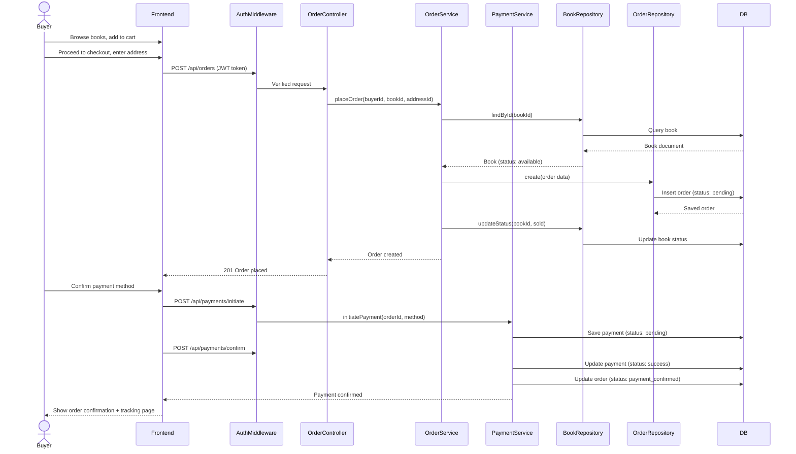
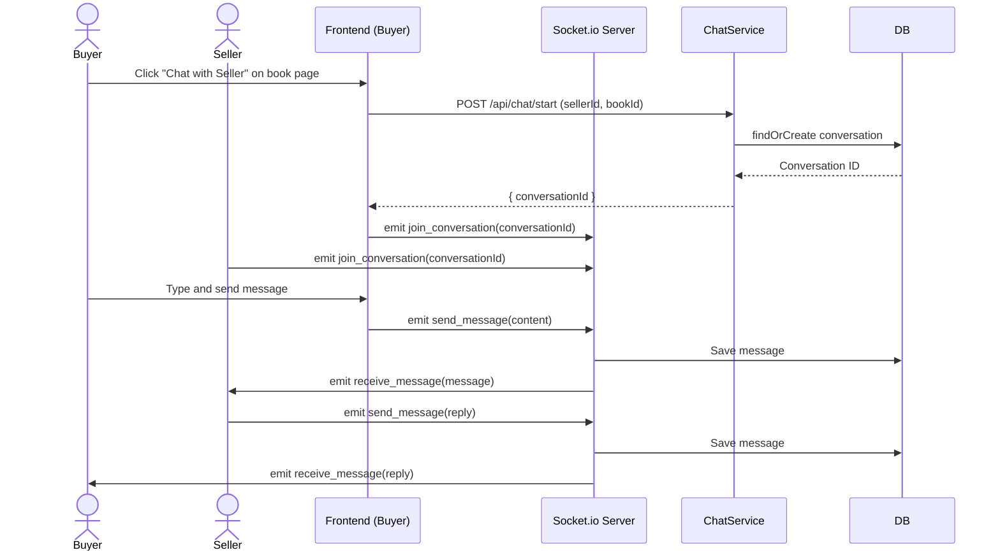

# Sequence Diagram — End-to-End Order Flow

```mermaid
sequenceDiagram
    actor Buyer
    participant Frontend
    participant AuthMiddleware
    participant OrderController
    participant OrderService
    participant PaymentService
    participant BookRepository
    participant OrderRepository
    participant DB

    Buyer->>Frontend: Browse books, add to cart
    Buyer->>Frontend: Proceed to checkout, enter address

    Frontend->>AuthMiddleware: POST /api/orders (JWT token)
    AuthMiddleware->>OrderController: Verified request

    OrderController->>OrderService: placeOrder(buyerId, bookId, addressId)
    OrderService->>BookRepository: findById(bookId)
    BookRepository->>DB: Query book
    DB-->>BookRepository: Book document
    BookRepository-->>OrderService: Book (status: available)

    OrderService->>OrderRepository: create(order data)
    OrderRepository->>DB: Insert order (status: pending)
    DB-->>OrderRepository: Saved order

    OrderService->>BookRepository: updateStatus(bookId, sold)
    BookRepository->>DB: Update book status
    OrderService-->>OrderController: Order created

    OrderController-->>Frontend: 201 Order placed

    Buyer->>Frontend: Confirm payment method
    Frontend->>AuthMiddleware: POST /api/payments/initiate
    AuthMiddleware->>PaymentService: initiatePayment(orderId, method)
    PaymentService->>DB: Save payment (status: pending)

    Frontend->>AuthMiddleware: POST /api/payments/confirm
    PaymentService->>DB: Update payment (status: success)
    PaymentService->>DB: Update order (status: payment_confirmed)

    PaymentService-->>Frontend: Payment confirmed
    Frontend-->>Buyer: Show order confirmation + tracking page
```

---

# Sequence Diagram — Real-Time Chat Flow

```mermaid
sequenceDiagram
    actor Buyer
    actor Seller
    participant Frontend as Frontend (Buyer)
    participant SocketServer as Socket.io Server
    participant ChatService
    participant DB

    Buyer->>Frontend: Click "Chat with Seller" on book page
    Frontend->>ChatService: POST /api/chat/start (sellerId, bookId)
    ChatService->>DB: findOrCreate conversation
    DB-->>ChatService: Conversation ID
    ChatService-->>Frontend: { conversationId }

    Frontend->>SocketServer: emit join_conversation(conversationId)
    Seller->>SocketServer: emit join_conversation(conversationId)

    Buyer->>Frontend: Type and send message
    Frontend->>SocketServer: emit send_message(content)
    SocketServer->>DB: Save message
    SocketServer->>Seller: emit receive_message(message)

    Seller->>SocketServer: emit send_message(reply)
    SocketServer->>DB: Save message
    SocketServer->>Buyer: emit receive_message(reply)
```
