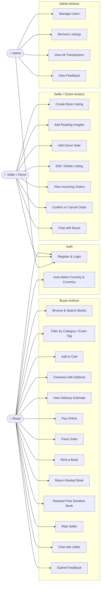

# Use Case Diagram

```mermaid
flowchart LR
    Buyer(["👤 Buyer"])
    Seller(["👤 Seller / Donor"])
    Admin(["👤 Admin"])

    subgraph Auth
        UC1[Register & Login]
        UC2[Auto-detect Country & Currency]
    end

    subgraph Buyer_Actions["Buyer Actions"]
        UC3[Browse & Search Books]
        UC4[Filter by Category / Exam Tag]
        UC5[Add to Cart]
        UC6[Checkout with Address]
        UC7[View Delivery Estimate]
        UC8[Pay Online]
        UC9[Track Order]
        UC10[Rent a Book]
        UC11[Return Rented Book]
        UC12[Request Free Donated Book]
        UC13[Rate Seller]
        UC14[Chat with Seller]
        UC15[Submit Feedback]
    end

    subgraph Seller_Actions["Seller / Donor Actions"]
        UC16[Create Book Listing]
        UC17[Add Reading Insights]
        UC18[Add Donor Note]
        UC19[Edit / Delete Listing]
        UC20[View Incoming Orders]
        UC21[Confirm or Cancel Order]
        UC22[Chat with Buyer]
    end

    subgraph Admin_Actions["Admin Actions"]
        UC23[Manage Users]
        UC24[Remove Listings]
        UC25[View All Transactions]
        UC26[View Feedback]
    end

    Buyer --> UC1
    Buyer --> UC2
    Buyer --> UC3
    Buyer --> UC4
    Buyer --> UC5
    Buyer --> UC6
    Buyer --> UC7
    Buyer --> UC8
    Buyer --> UC9
    Buyer --> UC10
    Buyer --> UC11
    Buyer --> UC12
    Buyer --> UC13
    Buyer --> UC14
    Buyer --> UC15

    Seller --> UC1
    Seller --> UC16
    Seller --> UC17
    Seller --> UC18
    Seller --> UC19
    Seller --> UC20
    Seller --> UC21
    Seller --> UC22

    Admin --> UC1
    Admin --> UC23
    Admin --> UC24
    Admin --> UC25
    Admin --> UC26
```
